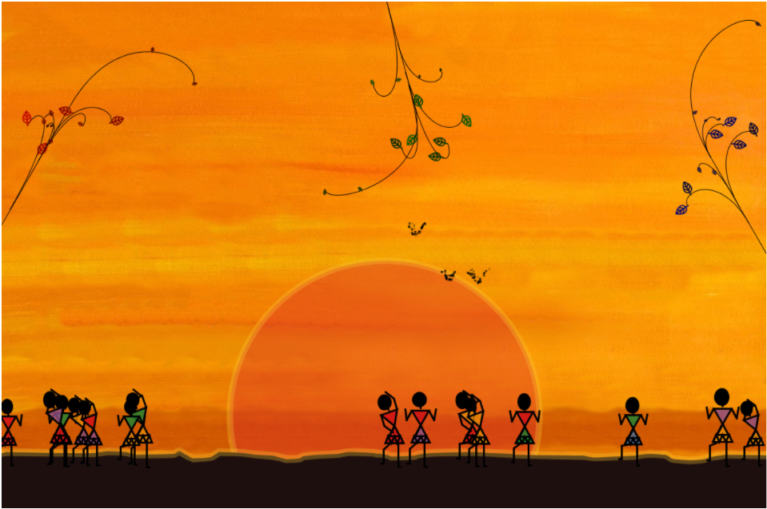

# JungleJam

#### A creative interactive application for collaborative jamming

## Introduction
JungleJam is a creative and interactive multi-user application developed by the group of students of Politecnico di Milano, as a final project for the course Creative Programming & Computing, in the academic year of 2020/2021.
The goal of the application is to build a creative, interactive and immersive experience, producing sound and visual content, driven by creative computing processes and the users’ behaviour. The users can interact with the application and contribute to the content creation, using their phones, and therefore sending the information from sensors to the computer. No previous musical background is required from the users, who are encouraged to create together, by dancing and moving their phones. 
The inspiration for the visual elements of the application is taken from Warli painting and computer nature representation, while the sound design and composition are inspired by African folk and tribal music.
The following scheme represents the main elements and mapping of the application.

> Scheme of the installation

## How to install

The full installation requires a PC and up to 3 Android phones, for the best experience. Each phone should have the app OSCHook installed and running to transmit the values of the phone’s sensors to the PC. On the PC, Processing and SuperCollider need to be installed and to run the following scripts: 
Visual.pde (RemoteJam/visual_part/Visual/Visual.pde) and 
cpc-oscJam-main.scd (RemoteJam/sounds_part/cpc-oscJam-main.scd).
 
Each tool can be downloaded and installed on the links below: 
* Processing: https://processing.org/download/ 
* SuperCollider: https://supercollider.github.io/download 
* OSCHook: https://play.google.com/store/apps/details?id=com.hollyhook.oscHook 
Note that for OSCHook to transmit to the PC where the processing script is running, PC and phones need to be connected to the same local network. For the OSC messages to reach the PC, the IP address of the PC and the port 7400 should be specified in the OSCHook app,as also defined in the Processing script. By default, on the new version of OSCHook, sensors are disabled and need to be enabled one by one.

## User experience

After the installation and establishing connection as described above, the users are encouraged to move their bodies and phones, hence creating together and being further driven by the content produced. Each user has their individual contribution to the content, yet if there is synchronization of all users’ actions, certain events will be triggered, such as the didgeridoo sound, or the change in the background color. 

## Content Detail

### Visual part

The visual content of the application is inspired by Warli painting, a tribal form of art based on geometrical elements, as representation of nature. On a painting-like orange background, the main visual elements are the trees, birds, stickmen (triangle-men) and the sun. The whole picture evolves with time, while each element’s behaviour is influenced by the users’ actions. 

> Screenshot of the visual part

### Sound part

The sound part was built using SuperCollider, the platform for audio synthesis and algorithmic composition. The sounds are inspired by the African folk and tribal music, and are created using both pre-recorded sound samples and the sound synthesis.